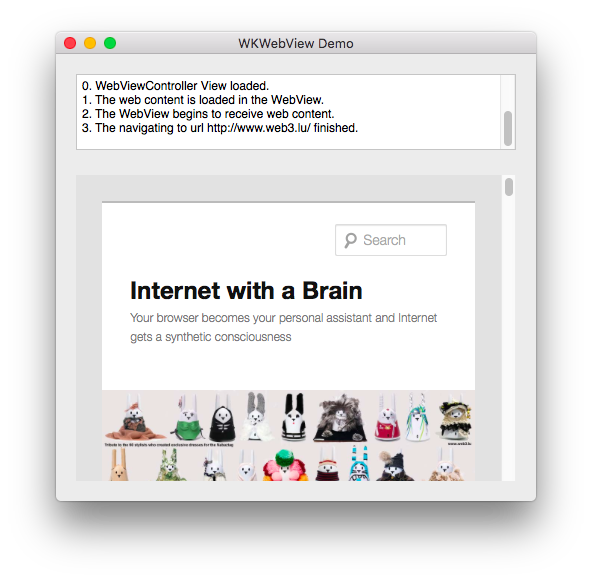

# WKWebView
OSX Swift 3 Demo App to show web content in a WkWebView with WebKit.

The present OS X Swift Class is related to the medical project [RadioLogic](http://www.radiologic.fr). The program has been developed and documented for my own needs. I think it may be of interest to other developers. For this reason I made it available as a public GitHub. If you find it useful, you are welcome. 

Additional Informations are available in the [project Wiki](https://github.com/mbarnig/WkWebView/wiki).
